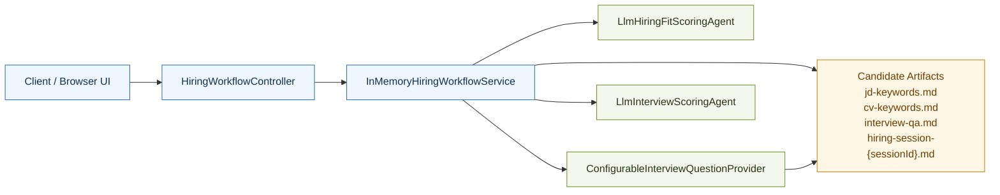

```mermaid
flowchart LR
   UI[Client / Browser UI]
   API[HiringWorkflowController]
   WF[InMemoryHiringWorkflowService]
   FIT[LlmHiringFitScoringAgent]
   QP[ConfigurableInterviewQuestionProvider]
   SCORE[LlmInterviewScoringAgent]
   FILES["Candidate Artifacts\njd-keywords.md\ncv-keywords.md\ninterview-qa.md\nhiring-session-{sessionId}.md"]

   UI --> API
   API --> WF
   WF --> FIT
   WF --> QP
   WF --> SCORE
   WF --> FILES
   QP --> FILES

   classDef runtime fill:#eef6ff,stroke:#2b6cb0,color:#12324a;
   classDef reasoning fill:#f4f7ec,stroke:#6b8e23,color:#283618;
   classDef storage fill:#fff7e6,stroke:#c77d00,color:#6b3e00;

   class UI,API,WF runtime;
   class FIT,QP,SCORE reasoning;
   class FILES storage;
```