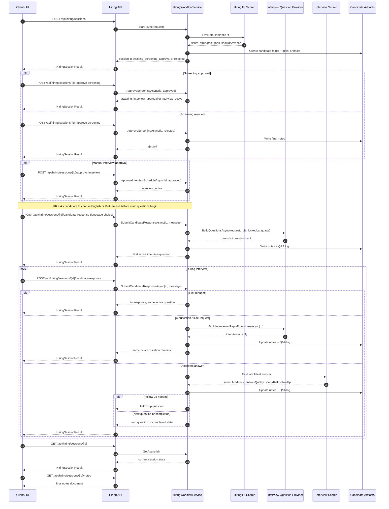

# PM Agent - Hiring Process Architecture

> Audience: solution architects, engineering leads, hiring managers, and stakeholders who need to understand how the current hiring workflow is designed, why it behaves this way, and where its trade-offs are.

This document describes the current Hiring Process as a runtime architecture, not just as a user flow. The goal is to explain the system the way a Solution Architect would review it: by looking at control flow, state transitions, context boundaries, operational behavior, and architectural strengths and weaknesses.

For a shorter business-facing version, see [hiring-workflow-business-summary.md](hiring-workflow-business-summary.md).
For a one-page management brief, see [hiring-workflow-executive-brief.md](hiring-workflow-executive-brief.md).

---

## 1. Executive Summary

The current Hiring Process is a stateful, approval-driven interview orchestration model exposed through `IHiringWorkflowService` and `/api/hiring/sessions`.

At a high level, the solution does five things:

1. Screens the candidate semantically against the project brief and JD.
2. Requires explicit approval before moving deeper into the process.
3. Locks the interview language before the main interview begins.
4. Generates a one-shot interview question bank focused on the current JD priorities and the candidate's demonstrated overlap.
5. Scores each accepted answer incrementally and can stop the interview early when confidence drops below the acceptable threshold.

This is no longer a keyword-matching workflow and no longer a purely hard-coded interview path. It is now a hybrid orchestration model:

- deterministic state machine for approvals and session control
- LLM-first reasoning for screening, question generation, and scoring
- structured fallbacks for resilience when model output is weak or invalid

---

## 2. Architectural Intent

From a solution architecture perspective, the Hiring Process is trying to balance four forces that naturally compete with each other:

| Design Force | Why It Matters | Current Architectural Response |
|---|---|---|
| Consistency | Interview sessions should follow a predictable operating model | Explicit stages, approval gates, locked language, fixed session state |
| Relevance | Questions should reflect the actual job and actual candidate | One-shot question bank generated from project brief + JD + CV |
| Conversational realism | The interview should feel human, not like a rigid form | Clarification flow, hint flow, interviewer feedback turns, conversational guardrails |
| Operational safety | The workflow must still behave when LLM output is missing or malformed | Fallback templates, fallback scoring, state persistence via transcript + notes |

The current model is therefore not “fully dynamic AI interview generation.” It is a governed interview runtime with AI-assisted decision points.

---

## 3. System View

### 3.1 Primary Components

| Component | Responsibility |
|---|---|
| `IHiringWorkflowService` | Owns the session state machine and runtime orchestration |
| `IHiringFitScoringAgent` | Performs semantic HR screening before interview start |
| `IInterviewQuestionProvider` | Builds the interview question bank and conversational interviewer replies |
| `IInterviewScoringAgent` | Evaluates accepted candidate answers and returns score + feedback metadata |
| Candidate Folder Artifacts | Persist reusable markdown and review material for each session |

### 3.2 Runtime State Model

The workflow uses these stages:

| Stage | Meaning |
|---|---|
| `awaiting_screening_approval` | HR screening passed and the system is waiting for approval to forward the CV |
| `awaiting_interview_approval` | PM prepared the schedule and the system is waiting for approval to start |
| `interview_active` | The live interview is running |
| `completed` | The session ended normally or was closed after the interview started |
| `rejected` | The candidate was rejected before interview progression |

`created` exists only as an internal bootstrap state before the first formal session result is returned.

### 3.3 Architecture Shape

```text
Client/UI
   |
   v
HiringWorkflowController
   |
   v
InMemoryHiringWorkflowService
   |----> LlmHiringFitScoringAgent
   |----> ConfigurableInterviewQuestionProvider
   |----> LlmInterviewScoringAgent
   |
   +----> candidate-{sessionId}/
            |- jd-keywords.md
            |- cv-keywords.md
            |- interview-qa.md
            |- hiring-session-{sessionId}.md
```

The important point here is that the orchestration service owns the state machine, while the LLM-backed services provide bounded reasoning inside that machine.

### 3.4 Component View

```mermaid
flowchart LR
   UI[Client / Browser UI]
   API[HiringWorkflowController]
   WF[InMemoryHiringWorkflowService]
   FIT[LlmHiringFitScoringAgent]
   QP[ConfigurableInterviewQuestionProvider]
   SCORE[LlmInterviewScoringAgent]
   FILES[Candidate Artifacts<br/>jd-keywords.md<br/>cv-keywords.md<br/>interview-qa.md<br/>hiring-session-{sessionId}.md]

   UI --> API
   API --> WF
   WF --> FIT
   WF --> QP
   WF --> SCORE
   WF --> FILES
   QP --> FILES

   classDef runtime fill:#eef6ff,stroke:#2b6cb0,color:#12324a;
   classDef reasoning fill:#f4f7ec,stroke:#6b8e23,color:#283618;
   classDef storage fill:#fff7e6,stroke:#c77d00,color:#6b3e00;

   class UI,API,WF runtime;
   class FIT,QP,SCORE reasoning;
   class FILES storage;
```

This view complements the sequence diagram later in the document:

- the component view explains the runtime building blocks and responsibility boundaries
- the sequence diagram explains how those components collaborate across API calls

---

## 4. End-to-End Runtime Flow

### 4.1 Session Bootstrap and HR Screening

The workflow starts at:

`POST /api/hiring/sessions`

Input surface:

- `projectBrief`
- `jobDescription`
- `candidateCv`
- `context`
- `technicalInterviewRole`
- `autoApproveInterviewSchedule`

At bootstrap time, the system:

1. Normalizes the technical role.
2. Resolves a seniority target.
3. Detects an initial language guess from the hiring materials.
4. Runs semantic fit scoring through `IHiringFitScoringAgent`.
5. Creates the candidate artifact folder immediately.
6. Writes HR screening context into the transcript.

If semantic fit fails or falls below the configured threshold, the workflow ends immediately as `rejected`.

Architecturally, this is a strong front-door filter. It prevents the system from paying the full cost of interview orchestration when the candidate is not even directionally aligned.

### 4.2 Approval Gate 1: CV Forwarding

If screening passes, the workflow does not move directly to the interview. It enters `awaiting_screening_approval`.

This decision is intentional. The design assumes HR screening should not automatically trigger a panel process without human sign-off.

If approved:

- participants become `HR`, `PM`, and one technical interviewer
- PM records scheduling context into the transcript

If rejected:

- the workflow terminates as `rejected`

### 4.3 Approval Gate 2: Interview Start

The PM scheduling step is always present after screening approval.

Two operating modes are supported:

| Mode | Behavior |
|---|---|
| Auto-approve | Starts the interview immediately after scheduling |
| Manual approve | Waits for explicit user approval before interview start |

This keeps the runtime flexible enough for both rapid demo usage and real human-operated review flows.

### 4.4 Interview Opening and Language Lock

Once the interview begins, the panel introduces itself through transcript turns:

- `HR`: communication observer and note keeper
- `PM`: project context interviewer
- `DEV` or `TEST`: technical depth interviewer

After the introductions, HR asks one explicit language-selection question:

`Before we start the interview, would you like to continue in English or Vietnamese? / Trước khi bắt đầu, bạn muốn phỏng vấn bằng tiếng Anh hay tiếng Việt?`

This language-selection step is architecturally important because it prevents a long-running session from drifting between languages.

From that point onward:

- the interview language is locked
- candidate-facing prompts follow that language
- clarification replies follow that language
- fallback templates follow that language
- the one-shot question bank is generated only after that choice is made

This is a materially better design than “best effort language switching on every turn,” because it removes ambiguity from the main evaluation flow.

### 4.5 One-Shot Question Bank Generation

After language selection, `IInterviewQuestionProvider` generates the main question bank once.

The current default order is:

1. One PM opening question
2. Eight technical questions for the selected technical interviewer
3. One HR closing / Q&A prompt

The bank is generated using:

- project brief
- job description
- candidate CV
- resolved seniority
- locked interview language
- selected technical interviewer role

The provider does not simply rank arbitrary keywords. It first tries to detect high-value skill areas from five categories:

| Category | Examples |
|---|---|
| Programming Languages | `C#`, `.NET`, `Java`, `Python`, `TypeScript` |
| Frameworks | `ASP.NET Core`, `Spring Boot`, `Django`, `React`, `Angular` |
| System Design | `microservices`, `distributed systems`, `API design`, `DDD`, `observability` |
| Databases | `PostgreSQL`, `SQL Server`, `MongoDB`, `Redis`, `schema design` |
| Agile / Scrum Methodology | `Agile`, `Scrum`, `sprint planning`, `retrospective`, `backlog refinement` |

From there, it builds:

- `RequirementFocus`
- `Overlap`
- `RequirementGaps`
- `CandidateAdjacencies`

The intent is to keep the interview focused on the current JD, not on unrelated strengths that happen to exist in the CV.

### 4.6 Fallback Question Strategy

If the one-shot LLM output is invalid, incomplete, or not in the locked interview language, the system falls back to configured templates.

Those templates are now:

- localized by language
- phrased using `RequirementFocusText`
- designed to stay close to architecture, implementation, debugging, database work, and delivery execution

This is one of the strongest design decisions in the current solution: fallbacks are not generic placeholders anymore; they are controlled templates shaped by the same requirement focus model.

---

## 5. Candidate Turn Classification Model

During `interview_active`, not every candidate message is treated as an answer.

The runtime classifies each candidate turn into one of these buckets:

| Candidate Turn Type | Runtime Behavior |
|---|---|
| Hint request | Routes to hint flow |
| Clarification / side request | Routes to conversational interviewer reply flow |
| Accepted answer | Routes to scoring and progression flow |

This is architecturally significant because it separates conversational control from evaluative control.

Without this classification layer, the system would incorrectly score clarification turns, process questions, or language questions as interview answers.

---

## 6. Interview Runtime Behaviors

### 6.1 Accepted Answer Path

When the candidate submits a real answer, the workflow:

1. Appends the candidate turn to transcript and Q&A log.
2. Adds a short HR note.
3. Runs the interview scoring agent.
4. Stores the answer score.
5. Recomputes the running session average.
6. Adds an interviewer feedback turn.
7. Either stops, asks a follow-up, or advances to the next queued question.

The session score is therefore not a single overwrite value. It is an aggregate of answer-level evaluation.

### 6.2 Follow-Up Path

Each `InterviewQuestion` may have one follow-up.

That follow-up is only used when:

- it exists
- it has not been used yet
- the answer quality is strong enough to justify going deeper

This prevents the old failure mode where a weak answer still triggered a deeper follow-up simply because one was configured.

### 6.3 Clarification and Side Questions

If the candidate asks a clarification or process question, the system:

- logs the candidate turn
- writes current notes
- generates an interviewer reply grounded in the current markdown notes
- keeps the same main question active
- does not score that turn as an answer

If this happens too many times on the same active question, the workflow adds a focus reminder and directs the candidate back to the active interview question.

This is a practical conversational guardrail. It protects the interview from devolving into a side discussion loop.

### 6.4 Hint Flow

Hints remain intentionally lightweight:

- return short keywords or prompts
- do not advance the question
- do not reveal the answer

This keeps hints as scaffolding rather than rescue logic.

---

## 7. Scoring Architecture

The current scoring model is answer-centric.

### 7.1 Primary Path

`IInterviewScoringAgent` uses an LLM to evaluate the latest accepted answer in transcript context.

The evaluator returns:

- `Score`
- `ShouldStop`
- `Rationale`
- `Dimensions`
- `Feedback`
- `AnswerQuality`
- `ShouldAskFollowUp`

### 7.2 Rubric Shape

The score is primarily intended to reflect:

- communication clarity
- problem solving
- technical judgment
- ownership
- collaboration

Situational or hypothetical responses are explicitly capped so most value must come from real delivery evidence.

### 7.3 Early Stop Logic

The workflow can terminate the interview early when:

- the evaluator says the session should stop
- the minimum answer count has already been reached

This avoids premature exit after a single weak first turn while still allowing the system to conserve time when repeated answers are clearly below the bar.

---

## 8. Persistence and Review Artifacts

For each session the system creates:

`candidate-{sessionId}/`

Artifacts:

| File | Purpose |
|---|---|
| `jd-keywords.md` | JD-derived extracted context plus original JD |
| `cv-keywords.md` | CV-derived extracted context plus original CV |
| `interview-qa.md` | Live Q&A log |
| `hiring-session-{sessionId}.md` | Full markdown notes snapshot |

This artifact model is valuable because it gives the workflow:

- traceability
- inspectable context
- post-interview review support
- a shared grounding source for runtime clarification replies

---

## 9. API Surface

### Start Session

`POST /api/hiring/sessions`

```json
{
  "projectBrief": "Hire a backend engineer for the platform team",
  "jobDescription": "Need C#, ASP.NET Core, PostgreSQL, Docker, and API design experience.",
  "candidateCv": "Built ASP.NET Core APIs with PostgreSQL, Docker, Azure deployment pipelines, and production support.",
  "context": "Remote-first team, two interviewers available this week.",
  "technicalInterviewRole": "DEV",
  "autoApproveInterviewSchedule": true
}
```

### Approve Screening Forward

`POST /api/hiring/sessions/{sessionId}/approve-screening`

### Approve Interview Start

`POST /api/hiring/sessions/{sessionId}/approve-interview`

### Submit Candidate Turn

`POST /api/hiring/sessions/{sessionId}/candidate-response`

### Request Hint

`POST /api/hiring/sessions/{sessionId}/hint`

### Get Current Session

`GET /api/hiring/sessions/{sessionId}`

### Export Notes

`GET /api/hiring/sessions/{sessionId}/notes`

---

## 10. API Sequence View

The diagram below shows the expected runtime sequence across the main API calls.



### Sequence Notes

- `POST /api/hiring/sessions` is the only entry point that can reject the candidate immediately based on screening fit.
- `POST /approve-screening` is the business approval gate for forwarding the CV into the panel workflow.
- `POST /approve-interview` exists only when manual interview approval is enabled.
- The first `POST /candidate-response` inside `interview_active` is reserved for language selection, not for technical evaluation.
- Subsequent `POST /candidate-response` calls are classified into hint, clarification, side-request, or accepted-answer paths before scoring happens.
- `GET /api/hiring/sessions/{id}` is the recovery endpoint for UI refresh or resume behavior.
- `GET /api/hiring/sessions/{id}/notes` is the review/export endpoint after or during the session.

---

## 11. Strengths of the Current Model

From a Solution Architect perspective, the current design has several strong qualities.

### 10.1 Clear Runtime Governance

The workflow is not an unbounded chat session. It is a governed interview runtime with explicit stage transitions, approvals, and decision points.

Why this is good:

- behavior is explainable
- UI state is predictable
- integration logic is simpler
- operational support is easier

### 10.2 Better Relevance Than Keyword Screening

The shift from keyword-only logic to semantic fit + focused skill categories significantly improves question relevance.

Why this is good:

- lower chance of false positive fit from superficial word overlap
- stronger alignment to the actual hiring request
- more technical specificity in interview content

### 10.3 Stronger Language Consistency

The explicit language-selection step is a sound architectural improvement.

Why this is good:

- removes ambiguity from candidate-facing content
- avoids mid-session language drift
- keeps notes, questions, and replies more coherent

### 10.4 Sensible Separation of Control and Evaluation

The system now distinguishes between:

- clarification
- hint
- side request
- actual answer

Why this is good:

- non-answer turns are not scored incorrectly
- the interview feels more natural
- conversational support no longer corrupts the evaluation path

### 10.5 Resilience Through Fallbacks

The architecture does not assume perfect model output.

Why this is good:

- invalid question banks can be replaced by localized templates
- invalid scoring output can fall back conservatively
- the workflow remains usable even when the model is inconsistent

---

## 12. Weaknesses and Limitations of the Current Model

The current design is materially stronger than earlier iterations, but it still has clear limitations.

### 11.1 Skill Extraction Is Still Catalog-Bound

The new requirement focus logic is better than flat token extraction, but it still depends on a curated skill catalog.

Limitation:

- uncommon stacks or niche frameworks may be under-detected
- multi-word phrases outside the catalog may be missed
- new technologies require catalog maintenance

Architectural implication:

- relevance quality is partially coupled to taxonomy upkeep

### 11.2 One-Shot Bank Generation Reduces Mid-Interview Adaptation

The one-shot bank improves consistency, but it reduces the system's ability to reshape the main interview path based on early strong or weak signals.

Limitation:

- the interview can still be highly relevant, but not fully adaptive in its main-question plan

Architectural implication:

- the model optimizes for control and predictability over continuous replanning

### 11.3 Notes Are Used for Clarification, Not Deep Replanning

The notes artifact is useful, but the current architecture mainly uses it for conversational replies rather than dynamic restructuring of the interview plan.

Limitation:

- insights discovered mid-interview do not heavily re-weight the remaining main questions

### 11.4 Current Role Model Is Narrower Than a Full Hiring Panel

The runtime currently behaves as `HR + PM + one technical interviewer`.

Limitation:

- cross-functional interview variety is intentionally reduced
- BA-style requirement probing is not a first-class runtime path anymore

Architectural implication:

- simpler orchestration, but narrower interview surface

### 11.5 Fallback Templates Are Stronger but Still Opinionated

The fallback templates are now more useful, but they still encode a particular view of what a strong technical interview should emphasize.

Limitation:

- if the organization wants very role-specific evaluation styles, template tuning will still be required

### 11.6 Session State Is In-Memory

The current workflow service is in-memory.

Limitation:

- no durable recovery after process restart
- horizontal scaling is constrained
- operational continuity depends on single-instance lifetime

This is the single biggest architectural limitation if the system moves from prototype or internal tooling toward production-grade usage.

---

## 13. Current Trade-Off Summary

The current architecture intentionally chooses:

| Chosen Direction | Gains | Costs |
|---|---|---|
| One-shot question bank | Stable interview flow, easier control, simpler UI expectations | Less adaptive main-question replanning |
| Locked interview language | Cleaner candidate experience, consistent prompts | Less freedom to switch language mid-interview |
| Category-aware skill focus | Better tech relevance, less noise | Requires taxonomy maintenance |
| Stateful orchestration | Predictable control flow | More orchestration logic and state complexity |
| In-memory session runtime | Fast local operation, low implementation overhead | Weak durability and scale characteristics |

---

## 14. Recommended Next Architectural Improvements

If this workflow continues evolving, these are the highest-value improvements.

### 13.1 Add Durable Session Persistence

Move session state from in-memory only to persistent storage.

Expected value:

- restart safety
- easier auditability
- multi-instance deployment readiness

### 13.2 Expand Skill Taxonomy to Phrase-Level and Role Packs

Continue extending the skill catalog for role-specific stacks.

Expected value:

- stronger focus detection for real hiring demand
- better handling of stack clusters such as `.NET + SQL Server + Azure DevOps + Scrum`

### 13.3 Introduce Controlled Mid-Interview Reprioritization

Keep the one-shot bank, but allow limited reprioritization of the remaining questions after major signals emerge.

Expected value:

- preserve control while improving adaptability

### 13.4 Add Interview Analytics Layer

Summarize question coverage, topic coverage, and answer quality per category.

Expected value:

- better post-interview review
- easier calibration across candidates

---

## 15. Final Architectural Assessment

The current Hiring Process is a good example of a pragmatic hybrid architecture.

It is not trying to be a fully autonomous interviewing system, and that is a strength. Instead, it uses deterministic orchestration for control, LLM reasoning for semantic quality, and structured fallbacks for safety.

In its current form, the model is already suitable for:

- internal hiring process experiments
- guided recruiting workflows
- hiring tooling where explainability and control matter more than full AI autonomy

Its strongest qualities are governance, relevance, and conversational realism.
Its weakest points are in-memory runtime durability, bounded skill taxonomy coverage, and limited adaptive replanning after the interview starts.

That is a reasonable architectural position for the current maturity level of the solution.